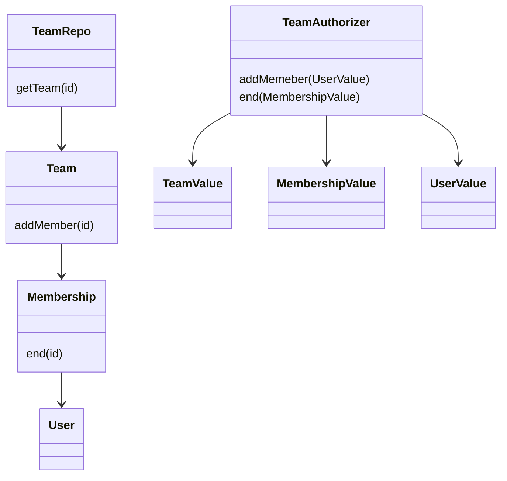

# The object compromise

I’ve observed a pattern I call the ‘object compromise’. It emerges when you believe traditional object-oriented programming is problematic, but are not using a fully functional language[1] (and don't wish to emulate one):

The ’rules’ that define the compromise are:

1. application data are plain values, not objects
2. use object method for code that performs side-effects[2] (and nowhere else)
3. pass objects' dependencies in constructors
4. never use inheritance in application code
5. construct all objects at application startup time (except where impossible)

This results in [flat system of stateless collaborative objects](#collaboration-emerges), with behaviour implemented via [methods not mutation](#orchestrate-with-methods-not-mutation). The object system is sparse as well as flat: there are [fewer objects](#fewer-deeper-objects) - on a type and instance basis - than in trad OO. Persistence is necessiarily [explicit](#persistence-is-explicit) - the Active Record pattern is completely contrary to the rules above.

This diagram of two implementations of a team membership system very roughly visualises a the flat and sparse object system vs traditional OO. There's only one object, and three values, vs four objects in the trad OO design.

You end up with a lot of objects that have more verb-y names. Behaviour is organised around use-cases, not data type. That's a good thing - you don't end up with your User and `$MostImportantDataType` (e.g `Tweet` for Twitter) classes growing unstoppably, which is what happens if you organise operations by data type.

## Collaboration emerges

Rule 4 means you have no inheritance hierarchy. That naturally forces you to structure you code via collaboration. 

## Statelessly emerges

Rule 5 ensures you wire up your graph of collaborators at application startup time.That makes it clear what is a runtime and what is a startup/config time dependency. I find for 95% of use-cases (e.g for only 5% of your app's API endpoints) there is no need to create objects at runtime.

The last 5% of cases cover two requirements. Firstly if you need polymorphism based on runtime data - e.g you load a flag from a database, and determine which implementation you need. Secondly for runtime state too complex to be handled by local variables and a sequence of method calls, that isn't better held in a memory store like Redis. Both are handled by adding factory methods to your service-lifespan objects to construct these short lived objects.

## Orchestrate with methods, not mutation

Methods orchestrate stateful processes with the help of multiple collaborators, and runtime state is handled by variables (or parameter passing). That's fine, as most applications keep application state outside the system in databases or in-memory stores.

The few places that emerge that do want runtime state therefore stand out - rather than being just another object with mutable fields. You'll construct them explicitly via factory methods, and they'll be passed between methods.

## Fewer, deeper objects

There are fewer objects relative to size of the system vs traditional OO style - both in number of constructors/classes but also in the number of instances. Behaviour that would traditionally be implemented using many objects will be handled by a single object orchestrating values returned from and passed into many collaborating objects (representing remote services, databases, etc).

## Persistence is explicit

This pattern completely rules out the active-record pattern. Your application data are values, they do not have behaviour attached. The benefit is that code which writes persistent application state becomes explicit - especially if you prefer `const` in TypeScript or avoid reassignment in Go. However, this is more work than having powerful (which must mean implicit) entity objects which can manage their own state.

This style is also more amenable to the extraction of services when necessary. Your logic doesn’t get written with assumptions about how data is persisted and retrieved. Attempting to add services to complex logic in - for instance - a Rails app which makes heavy use of reads and writes via model relationships will require a rewrite of that use-case. Here, you’ll change the implementation of some object collaborators to be remote, and only have to add RPC error-handling logic to callers.

## FAQ

### But objects mean ${otherThing}

When I say object I have in mind Alan Kay’s original conception: code that communicates via messages, not by exposing internals for reading or mutation. I don’t mean JavaScript (or Java’s) `Object`, or a mutable hash-map. I am referring to the ‘communicate via messages’ pattern which can be implemented in many ways in many languages (e.g Erlang has real messages with an inbox, JavaScript emulates it simply by functions which refer to `this`, Ruby has a distinct dispatch step for message/method sends).

Objects do not have value semantics - the instance you have matters, regardless of whether its replies to messages are currently the same as another object. This is essential to object behaviour - two objects with ‘the same’ value now may be in the midst of two very different stateful processes talking to different collaborators, and treating them as interchangeable would be disastrous.

Mutable fields violate the clarity of communication via messages in Kay’s vision. Setters and getters are symptoms of a procedural style of OO, which is likely to be using objects as mutable data-structures not collaborators.

Inheritance - most perniciously when combined with mutable fields - makes analysing and extending object-oriented systems much harder due to the intimate but implicit coupling it compromises. Collaboration has proved to be the better approach.

### What are values?

Values are data which are equal if their component parts are equal. For instance, `let a = 1; let b = 1; a == b` is a simple example of value semantics: data in different memory locations is equal. Complex data can also have value semantics - for instance two address structs with the same street, town and country. Value semantics can also be thought of as the opposite of object semantics: object equality semantics mean objects are only equal to themselves, i.e comparison of two references to the same place in memory.

### Is this just the functional core, imperative shell?

Somewhat, except there isn’t much of a functional core, i.e I haven’t observed a meaningful amount of application logic implemented as functions and values which is then manipulated by objects. Here application logic is interwoven in methods on objects. I’ve not seen a large functional-core imperative-shell application so I’ll not comment on whether that would be ‘better’, I think the pro/cons would be depend on the domain and project/team maturity.

### Is it just good object-oriented style?

Probably, but there is no general definition of good object-oriented style 😁. This pattern is largely equivalent to the style and nomenclature of [Growing Object-Oriented Software Guided by Tests](http://www.growing-object-oriented-software.com). However, there it’s defined in top-down, abstract terms (“Compose objects to describe system behaviour”). I find a strict, bottom-up, focus on language features provides a more precise (and easy to follow) definition.

- [1] I’ve had most experience of this style writing Go at GitHub and Plaid, and TypeScript for my own projects. Both JavaScript and Go have functional features, but compared to, say, Haskell or Clojure, they clearly lack core primitives for handling state in a functional way (monads or atoms etc respectively), and aren’t idiomatically functional ‘in the large’ (i.e beyond Array.reduce)
- [2] including method calls on objects. Aside from that, the usual: network, logging, metrics, disk, databases, randomness, etc.
